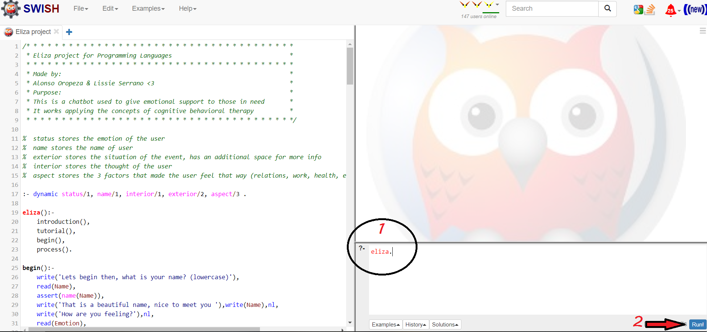

# Eliza
Prolog NLP & cognitive behavioural therapy program.

Alonso Oropeza et Lisieux Serrano.

---
### Links
Check this [article](https://a01207648.medium.com/elizas-emotional-support-in-times-of-covid-prolog-implementation-20a06601c6d8) to understand the heart of the project. 

If you want to see what is inside the black box, check the [handbook](https://docs.google.com/document/d/1WVpbfVb5ezepsdpwlL0w93YCk4Lmy-G8l5KOliERiO8/edit?usp=sharing).

Special thanks to the [beta testers](https://blm40341o41.typeform.com/to/VWwB1ZQ6), you are making this project posible.

---

### How to run it

1. Download [SWI-Prolog](https://www.swi-prolog.org/download/stable) or go to [SWISH](https://swish.swi-prolog.org/) on your web browser.
2. Download the [latest stable version](https://github.com/AlonsoOropeza/Eliza/releases) from the repository, save it with .pl extension.  
2.1. Otherwise, copy the code from the [latest stable version](https://drive.google.com/drive/folders/1vofNHv89TOOc2rSNBihmJt7lDVo3FpAk?usp=sharing) from Drive, and paste it in a new pl file.
3. Load the file into the IDE.
4. Run the code by typing the rule eliza.  

